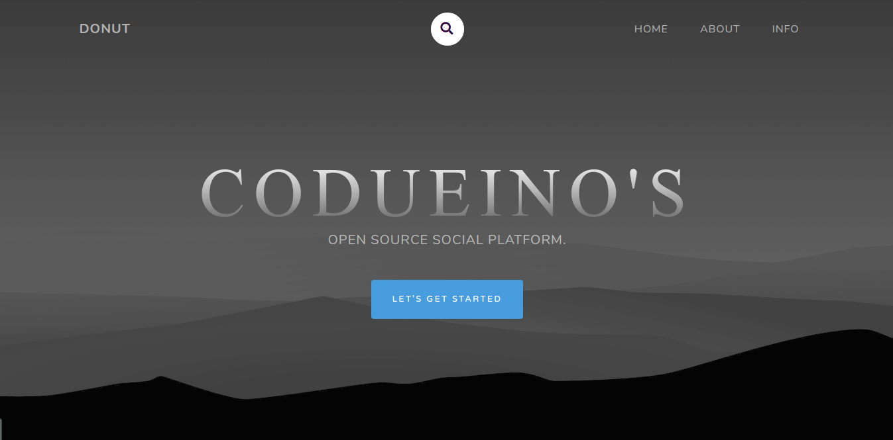
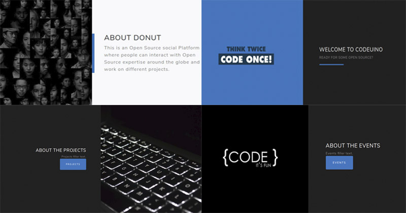
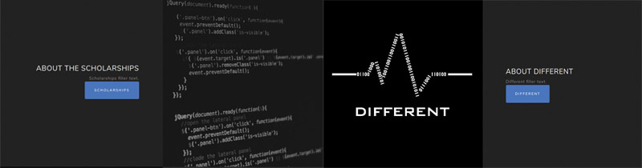
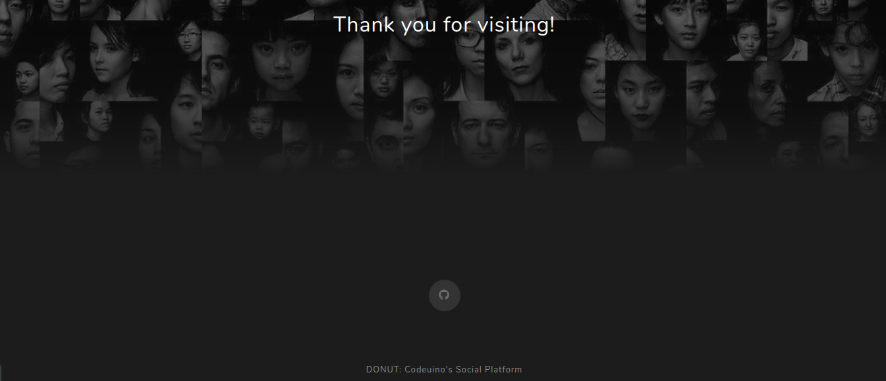

## For frontend of this repo move to this repository https://github.com/codeuino/frontened

# Donut-

[](https://codeuino.slack.com)    [](http://makeapullrequest.com) [](https://www.gnu.org/licenses/gpl-3.0)

# HOME



# About




# INFO



---
## What is Donut?

Being inspired by the Cornucopia of various social hub this project has been developed taking into consideration about open source. Well, this is an Open Source Social networking hub which acts as a bridge between various Developers, Organisations and Open Source aspirants to elaborate on various things like #Projects, #Events, #Discussion on various researches, #Scholarships, #Coding release and various other things updates. 
The major priority of this project has been that this platform allows users to make their project "Open Sourced" and released them under various open source Organisations, experts which hold up a ring plate on this portal. This platform also makes users introduce and develops various solutions in the form of FOSS software to publish them for public use by integrating them with their social cause. Moreover, this project can be downloaded by any user, organization and can be used by them in their own custom way, making it run on their servers. 
It is built on Node.js and utilizing mongoose as a database.

## Technical Features
--------------------
* Sign Up / Login Authentication
* Node.js basic Password Authentication ( Uses Unique email and Password )
* Third party access login
* Sign Up as a User and Organisation
* Write any Post that acts as a Feed ( with various formatting tools, tags effect, etc )
* Propose any project that a person wants to raise as researched under various organizations and experts.
* Write Events and get updates of various Events happening around.
* Scholarship Raiser, Open Source Internships.
* Open up the environment for the discussion through integrated Discussion platform
* Act with Open Stat
* Appropriate Dashboard with most APIs Activities log of projects and other things.
* Sourced Packaged, Custom made software ( can be changed according to needs after downloading it.
* Provides various opportunities to integrate many other Open Source projects recognized by organizations


Installation
------------
To get this project running locally on your machine follows the steps below in order:

1. fork this repo
2. clone the forked repo from your GitHub using the command `git clone https://github.com/username/Social-Platform-Donut.git` don't forget to replace the username in the URL


3. Checkout to the development branch

```shell
    git checkout development
```

4. Setting up the project locally.

```shell
npm install
```
5.Setting up the local database instance 
      You need to have a MongoDB atlas account to create local
      https://www.youtube.com/watch?v=KKyag6t98g8
      Check out the above link to setup MongoDB atlas.
      The mongodb URL should be pasted in credential.js files.
      
 6. run this command to run on local

```shell
nodemon server.js
```
or
```shell
node server.js
```

HURRAY! you have done it just start contributing to the project.

Now open your browser and type the link `http://localhost:3000` to continue viewing project.

Setting Up Database
------------
Make sure you have MongoDB installed on your computer. If not get it here [MongoDB Community Server](https://www.mongodb.com/download-center/community)

1- Open the terminal, locate the "scripts" folder and run the dbcreater.sh

```shell
bash dbcreater.sh
```

For windows user, run this command using [git bash](https://git-scm.com/download/win)


## Contributions Best Practices

**Commits**
* Write clear meaningful git commit messages (Do read http://chris.beams.io/posts/git-commit/)
* Make sure your PR's description contains GitHub's special keyword references that automatically close the related issue when the PR is merged. (More info at https://github.com/blog/1506-closing-issues-via-pull-requests )
* When you make very very minor changes to a PR of yours (like for example fixing a failing Travis build or some small style corrections or minor changes requested by reviewers) make sure you squash your commits afterward so that you don't have an absurd number of commits for a very small fix. (Learn how to squash at https://davidwalsh.name/squash-commits-git )
* When you're submitting a PR for a UI-related issue, it would be really awesome if you add a screenshot of your change or a link to a deployment where it can be tested out along with your PR. It makes it very easy for the reviewers and you'll also get reviews quicker.

## Community

All feedback and suggestions are welcome!

* 💬 Join the community on [Slack](https://join.slack.com/t/codeuino/shared_invite/enQtMzcxOTQwNzE4NzcxLWEyNzUxYjI0ZThiNWUyYWI5MzJlMTNmODMxN2NjMTcxODJkZmFhNTVkYmUyOTQ1YzgzNTlmMTVkYzVhMzdmNTQ )
* 📣 Stay up to date on new features and announcements on the following
1.[@Mailing List](codeuino-devel@googlegroups.com).
1.[@Discussion Portal](https://groups.google.com/d/forum/codeuino-devel).
1.[@Codeuino Wiki](wiki.codeuino.org).


## Sponsors/Partners

Support this project by becoming a sponsor/collaborator/partner/contributors. 
[[Become a sponsor](https://codeuino.org/)]

#### Current

<a href="#" target="_blank"></a>
<a href="#" target="_blank"></a>


## Licensing

<b>Donut An Open Source Social Collaborating platform is a web Based framework Software,
  
   Copyright (C) < 2018 Codeuino Contributors >
This program is free software: you can redistribute it and/or modify
    it under the terms of the GNU General Public License V3 as published by
    the Free Software Foundation, either version 3 of the License, or
    (at your option) any later version.

This program is distributed in the hope that it will be useful,
    but WITHOUT ANY WARRANTY; without even the implied warranty of
    MERCHANTABILITY or FITNESS FOR A PARTICULAR PURPOSE.  See the
    GNU General Public License for more details at OSI <https://opensource.org/licenses/GPL-3.0>

You should have received a copy of the GNU General Public License
    along with this program.  If not, see <http://www.gnu.org/licenses/>.
